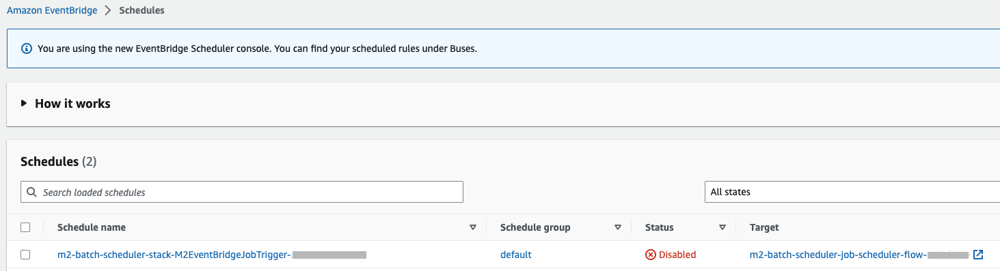
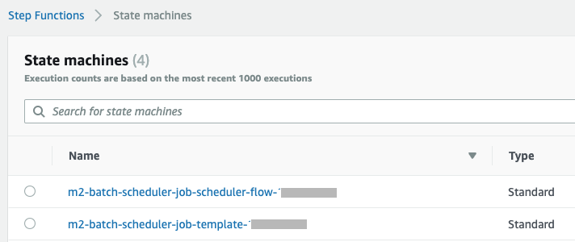
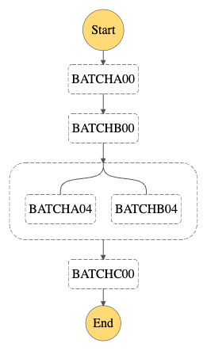

# AWS Mainframe Modernization Batch Scheduler

## Introduction
The solution demonstrates how Amazon EventBridge and AWS Step Functions can be utilized to build a batch job scheduler for AWS Mainframe Modernization. AWS Step Functions defines the job flow and Amazon EventBridge scheduler triggers the job flow at a specific time.

## Prerequisites
* Familiarity with AWS Mainframe Modernization service
* Knowledge on Mainframe COBOL and JCL programming and operations
* Basic understanding of Amazon EventBridge Scheduler and AWS Step Functions

## Architecture Diagram
High-level architecture diagram how the scheduler works end-to-end.

Simplified version of job template using the AWS Step Functions' Job Poller pattern.

Orchestration of jobs using the AWS Step Functions JobTemplate. Jobs S1, S2, Parallel Set and S3 run serially. Jobs P1, P2 and P3 run in parallel. The job flow itself is triggered by Amazon EventBridge.

## Installation
Follow the steps below to download and deploy the resources to AWS.

#### 1. Download the Code from Github:

- Download the CloudFormation template 'm2-batch-scheduler-cfn.yml'
- Download the content of folder 's3-content-for-replatform-batch' onto your local machine

#### 2. Create S3 bucket and upload artifacts:

- Login to your AWS Account and create a new S3 Bucket
- Upload the content of the folder 's3-content-for-replatform-batch' starting from folder v1

Sample S3 Bucket structure after upload.

#### Components:
- CBLHELLO - The components ending with .idy, .o and .so are Microfocus runtime artifacts for COBOL program. The source code is provided in the Github folder 's3-content-for-replatform-batch/v1/cbl/'
- BATCH*00.JCL - Set of JCLs that will execute COBOL program CBLHELLO and end successfully with return code as 00
- BATCH*04.JCL - Set of JCLs that will execute COBOL program CBLHELLO and end successfully with warning with return code as 04
- BATCH*16.JCL - Set of JCLs that will execute COBOL program CBLHELLO and fail with return code as 16

_The sets of jcls are provided for experimentation with different combination of job return code._

#### 3. Run CloudFormation Template:

- Create a new stack on CloudFormation using the template 'm2-batch-scheduler-cfn.yml'
- On specify stack details page, provide the S3 bucket name created in step 2
- Other parameters may be left as defaults

Sample stack details.

Following AWS resources are created once the CloudFormation template executes successfully

#### 4. Deploy Application onto Environment:
- Select AWS Mainframe Modernization service on AWS Console
- Under Applications select the one starting with 'm2-batch-scheduler-m2-app-' and from Actions dropdown menu select 'Deploy Application'
- Under Environments select the radio button for the one starting with 'm2-batch-scheduler-m2-env-' and click Deploy

#### 5. Start Application:
- Once the Application moves to Ready status, click on Action dropdown menu and click Start application
- Once the Application moves to Running status, the installation is complete
- Navigate to different services on AWS Console to check on the different resources created - 
- Amazon EventBridge -

- Step Functions -

  

## Testing
In this demonstration following job flow is created. BATCHA00, BATCHB00, parallel jobs and BATCHC00 run serially. BATCHA04 and BATCHB04 runs in parallel.

- The EventBridge scheduler is installed by default as DISABLED and one time schedule is set to start at Jan 01, 2023
- In the EventBridge console, select the scheduled and click on the Enable button
- Switch to the Step Functions service on AWS Console and check the executions for the State Machine starting with 'm2-batch-scheduler-job-scheduler-flow-'
- After few minutes refresh the Executions and there will be one execution in Running status
- Monitor the progress by clicking on job names on graphical view
- Successful completion will be marked by green color
- Explore different tabs on the page to look for Definition, Input, Output, Events, etc.
- Click on the Execution to dig into details of each job run
- The SYSOUT of the jobs are available in the Output tabs of Step Functions, so there is no need to separately search for the logs in Cloud Watch

#### [Restarting a Failed job stream]
- Run the failed job separately after fixing the issue
- Clone the job Flow using the 'Copy to new' under Action dropdown menu
- Change the Workflow 'Start at' to the next job from where the processing will resume

## Clean up
If you no longer need the resources that you created for this solution, delete them to avoid additional charges. To do so, complete the following steps:
* On AWS Console access the AWS Mainframe Modernization service and stop the Application
* Once the Application is stopped, delete the Application from the Environment
* Access the CloudFormation service and delete the stack used to create all the resources

## References

* [AWS Mainframe Modernization user guide](https://docs.aws.amazon.com/m2/latest/userguide/what-is-m2.html)
* [AWS Mainframe Modernization Application definition reference](https://docs.aws.amazon.com/m2/latest/userguide/applications-m2-definition.html)
* [Amazon EventBridge Scheduler user guide](https://docs.aws.amazon.com/scheduler/latest/UserGuide/what-is-scheduler.html)
* [AWS Step Functions developer guide](https://docs.aws.amazon.com/step-functions/latest/dg/welcome.html)
* [AWS Step Functions Workshop](https://catalog.workshops.aws/stepfunctions/en-US)

## Security

See [CONTRIBUTING](CONTRIBUTING.md#security-issue-notifications) for more information.

## License

This library is licensed under the MIT-0 License. See the LICENSE file.

